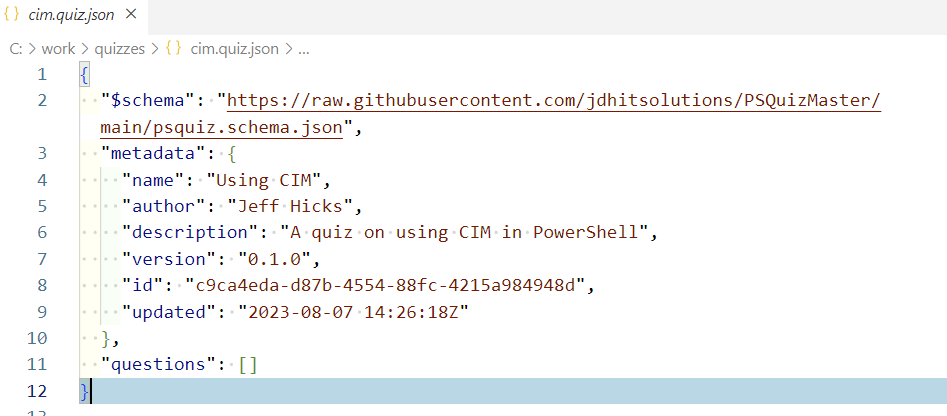
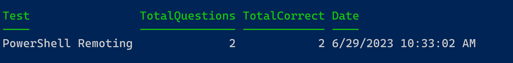
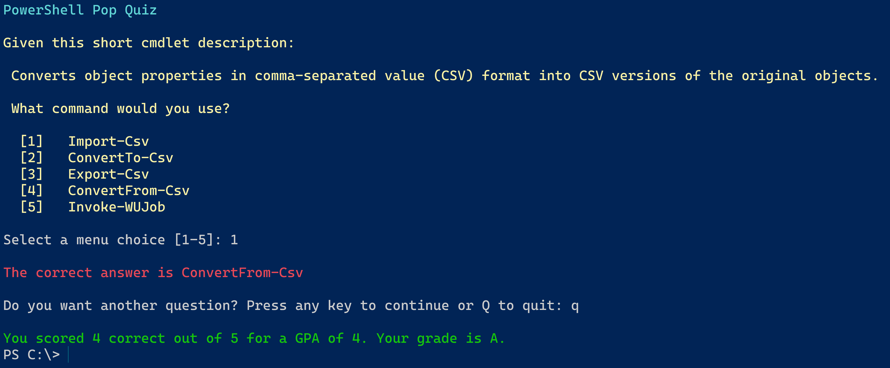

# PSQuizMaster

[](https://www.powershellgallery.com/packages/PSQuizMaster/) [](https://www.powershellgallery.com/packages/PSQuizMaster/)

This PowerShell module consists of two parts, commands to generate quizzes or testing material, and commands for taking a test. Quiz files are stored as JSON documents.

- [New-PSQuizQuestion](docs/New-PSQuizQuestion.md)
- [Invoke-PSQuiz](docs/Invoke-PSQuiz.md)
- [Invoke-PSQuickQuiz](docs/Invoke-PSQuickQuiz.md)
- [Get-PSQuiz](docs/Get-PSQuiz.md)
- [Set-PSQuizFile](docs/Set-PSQuizFile.md)
- [New-PSQuiz](docs/New-PSQuiz.md)

You can install the module from the PowerShell Gallery.

```powershell
Install-Module PSQuizMaster
```

Most commands should work cross-platform.

## Design

Quizzes are stored as JSON files. Each quiz has a set of questions which includes a set of distractors. You can add a note to each question to provide additional insights or information.

The module commands will look for quiz files in the location defined in the global variable `$PSQuizPath`. The default value is the `Quizzes` folder in the module directory.

## Creating a Quiz

The easiest way to create a quiz is to use the `New-PSQuiz` command. This will guide you through the process of creating a quiz file.

```dos
PS C:\> New-PSQuiz
What is the full name of your quiz?: PowerShell Remoting
What is the short quiz name? This will be used as part of the file name: remoting
Enter a quiz description. You can always edit this later: A short quiz on PowerShell remoting
Enter the author name: Jeff Hicks
Enter the question: What command do you run to enter an interactive remoting session?
Enter the answer: Enter-PSSession
Enter a comma-separated list of distractors: New-PSSession,New-CimSession,Enter-CimSession,Winrm
Enter any notes for this question: Don't confuse PSSessions with CimSessions.
Add another question? (Y/N): y
Enter the question: What is the default PowerShell remoting port?
Enter the answer: 5985
Enter a comma-separated list of distractors: 5986,22,80,443
Enter any notes for this question: If using SSL, the default port will be 5986.
Add another question? (Y/N): n

Name        : PowerShell Remoting
Author      : Jeff Hicks
Version     : 0.1.0
Description : A short quiz on PowerShell remoting concepts.
Questions   : 2
Updated     : 6/29/2023 10:21:21 AM
Path        : C:\Scripts\PSQuizMaster\quizzes\remoting.quiz.json
```

This will create this JSON file.

```json
{
  "metadata": {
    "name": "PowerShell Remoting",
    "author": "Jeff Hicks",
    "description": "A short quiz on PowerShell remoting concepts.",
    "version": "0.1.0",
    "id": "32248289-3ca9-4fb6-acde-524c809bf50e",
    "updated": "2023-06-29 14:21:21Z"
  },
  "questions": [
    {
      "question": "What command do you run to enter an interactive remoting session?",
      "answer": "Enter-PSSession",
      "distractors": [
        "New-PSSession",
        "New-CimSession",
        "Enter-CimSession",
        "Winrm"
      ],
      "note": "Don't confuse PSSessions with CimSessions."
    },
    {
      "question": "What is the default PowerShell remoting port?",
      "answer": "5985",
      "distractors": [
        "5986",
        "22",
        "80",
        "443"
      ],
      "note": "If using SSL, the default port will be 5986."
    }
  ]
}
```

Quiz files should follow the naming convention of `<shortname>.quiz.json`.

You can also use the `New-PSQuizFile` command to create a quiz file and then use `New-PSQuizQuestion` to create questions. Add the questions to the file using `Set-PSQuizFile`.

## Editor Integrations

The module includes several editor-related features that you might find helpful. Especially if you find it easier or faster to create a quiz file by editing the JSON file directly.

### Schema

The JSON file includes a public schema. If you open the quiz JSON file in VS Code, you can get tab completion and assistance in adding questions to the file or adjusting the metadata. There is no reason to remove the schema reference in the file.

### Editor Shortcuts

When editing a quiz JSON file, the `Updated` property needs to follow a specific format. When you import this module in VSCode, you will get an additional module command called `Insert PSQuiz date.` Set your cursor in the JSON file where you have deleted the updated value. Open the command palette, select `Show Additional Commands from PowerShell Modules`, and then click `Insert PSQuiz Date.` The proper date string will be inserted into the file.

In the PowerShell ISE, importing this module will create an Add-ons menu called `Insert Quiz UTC Date` that will achieve the same result.

### UseEditor

When using this module in the PowerShell ISE or VS Code, when running `New-PSQuiz` or `New-PSQuizFile`, you can use the `UseEditor` dynamic parameter. This will open the quiz JSON file in the current editor.

```powershell
New-PSQuizFile -Name "Using CIM" -ShortName cim -Path c:\work\quizzes -Author "Jeff Hicks" -Description "A quiz on using CIM in PowerShell" -UseEditor
```



You could then use code like this to generate quiz questions.

```PowerShell
 New-PSQuizQuestion | ConvertTo-Json | Set-Clipboard
```

Paste the question into the JSON file and repeat.

## Taking a Quiz

To take a quiz, use `Invoke-PSQuiz`. You need to specify the full path to the JSON file. By default, the function will tab-complete quiz files found in $PSQuizPath.


The quiz is presented interactively. Questions and answers are presented in random order.

When you are done, you will see a summary of your results.



## PSQuizMaster Settings

The default quiz location is determined by the value of the global `$PSQuizPath` variable. If you don't want to be constantly updating this variable every time you import the module, you can run `Set-PSQuizPath` and specify a new location.

```powershell
Set-PSQuizPath c:\work\quizzes
```

This will create a file under $HOME called `.psquizsettings.json` The path will be stored in this file. The next time you import the module, if this file exists, the module will use the saved location. You should not need to edit or do anything with this file. If you want to remove it, you should use `Remove-PSQuizSetting` which will delete the settings file and set the value of `$PSQuizPath` back to the module default.

## Sample Quizzes

The module contains several sample quizzes you can find in the [Quizzes](quizzes) folder. If you don't change the value of `$PSQuizPath` you should be able to find them with `Get-PSQuiz`.

If you have changed the path location, you can use `Copy-PSSampleQuiz` to copy the samples to the new destination.

## PSQuickQuiz

The module contains a command to dynamically generate a quiz based on commands found in one or more modules. This is a great way to test your knowledge of PowerShell commands.

```dos
PS C:\> Invoke-PSQuickQuiz -Module Microsoft.PowerShell.*
```

This will generate a dynamic quiz based on the commands found in the specified modules.



## Ideas and Project Road Map

- Check for the latest version of questions from a GitHub repository or path, including a UNC.
- Store long-term test results somewhere. Maybe use a database like SQLite, or maybe a JSON file.
- Create WPF or TUI front-ends for creating and taking quizzes.
